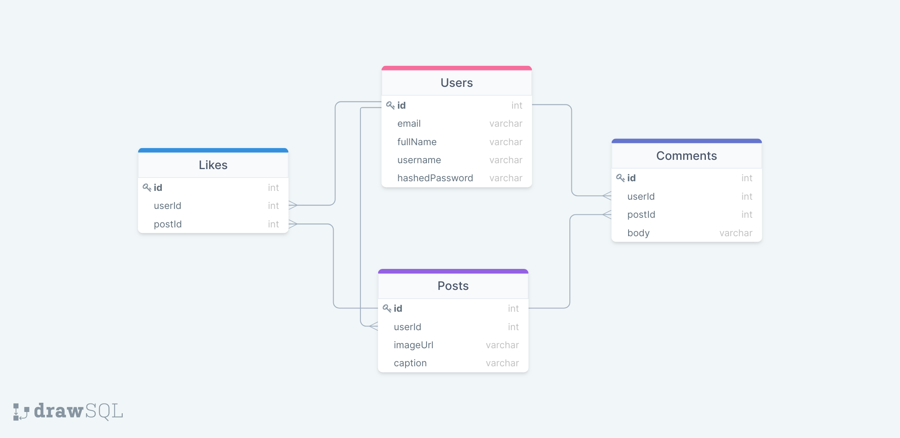

> # **Petgram (Instagram-clone)**
---


> ## **About**
---

>> ***Petgram is a clone of the popular social media application 'Instagram'. Instagram is a secure platform where users can sign-up, upload pictures, and view what other people have uploaded. Users can then like and comment on the posts they like. Petgram will try to emulate as much functionality as Instagram as possible, with the only difference being Petgram is for Pets!***

---

> ## **Schema** 
---



---

> ## **Sample Front End State**
---

```
 {
  authentication: {
    1: {
    createdAt: "2020-08-27T23:10:24.991Z",
    email: "demo@example.com",
    id: 1,
    name: "Demo-lition",
    updatedAt: "2020-08-29T16:21:07.669Z",
    },
  }
  users: {
   1: {
    id: 1,
    username: "Demo-lition"
   }
  }
  posts: {
    1: {
      id: 1,
      userId: 1,
      imageUrl: "images/demo.png",
      caption: "This is demo post!",
    }
  }
  comments: {
   1: {
    id: 1,
    userId: 6,
    postId: 3,
    body: "That is a great demo post!"
   }
  }
}
```

---

> ## **Back end routes**
---

>> - Get User: GET */api/session*
>>
>> - Login: PUT */api/session*
>>
>> - Sign-up: POST */api/users*
>>
>> - Logout: DELETE */api/session*
>>
>> - List Posts: GET */api/posts*
>>
>> - Add Post: POST */api/posts*
>>
>> - Delete Post: DELETE */api/posts/id*
>>
>> - Get user: GET */api/users/:id*

---

> ## **Front end routes**
---

>> - Login:  */login*
>>
>> - Sign-up:  */signup*
>>
>> - Home Page:  */*
>>
>> - User profile:  */:username*

---

> ## **MVP List with deadlines**
---

>> ### ***Sign-up***
>> - As a user, I want to sign-up for access to Petgram, so that I can interact with other users by posting pet pictures with a caption.
>> - *Expected completion day - Monday*
>>
>> ### ***Login***
>> - As a user, I want to login to Petgram, so that I can start viewing what other users are posting and be able to post myself.
>> - *Expected completion day - Monday/Tuesday*
>>
>> ### ***Demo User***
>> - As a user, I want to able to quickly demo the app via accessing it with the demo user login option.
>> - *Expected completion day - Tuesday/Wednesday*
>>
>> ### ***Home Page***
>> - As a user, I want to see what other users are posting on the home page.
>> - *Expected completion day - Thursday/Friday*
>>
>> ### ***Comments***
>> - As a user, I want to able to comment on a post by another user.
>> - *Expected completion day - Friday/Weekend*

---

> ## **Stretch Goals**
---

>> ### ***User Profile***
>> - As a user, I want to able to view all my old posts on my profile page.
>>
>> ### ***Likes***
>> - As a user, I want to able to like a post by another user.
>>
>> ### ***AWS S3***
>> - As a user, I want to upload a picture from my device.

---
